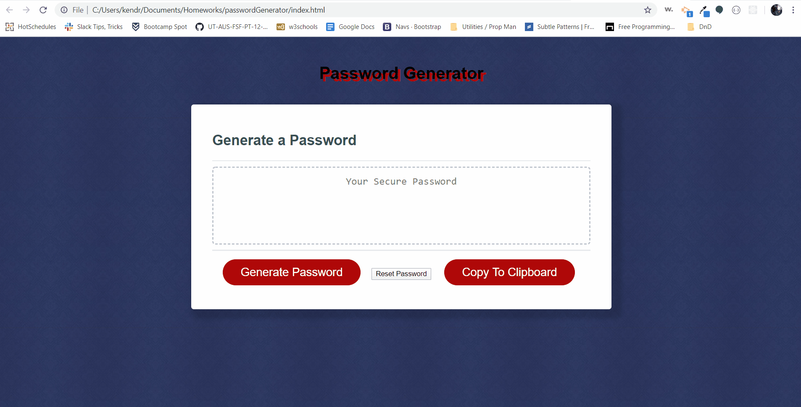

# Password Generator
This project will allow a user to create a randomly generated password using 4 suggested variables. The user can select any or all of the variables to use in their password. If they do not select any variables to use, it will not create a password. If they would like to start over with a new password, they can "reset" the generator by pressing the Reset button. If they would like to "copy" their password, they may press the Copy To Clipboard button.

## Deployment Link
https://kkwoka.github.io/passwordGenerator/

## Table of Contents 
* [Files](#Files)
​
* [GIF](#GIF)
​  ​
* [Questions](#questions)

## Files
* index.html
* README.md
* Assets/
    * psuedocode.txt
    * script.js
    * style.css
    * Assets/Images
        * PasswordGenerator.png
        * CopyToClipboard.png

## GIF

## Questions
​

​
If you have any questions about the repo, contact [kkwoka](https://github.com/kkwoka).
